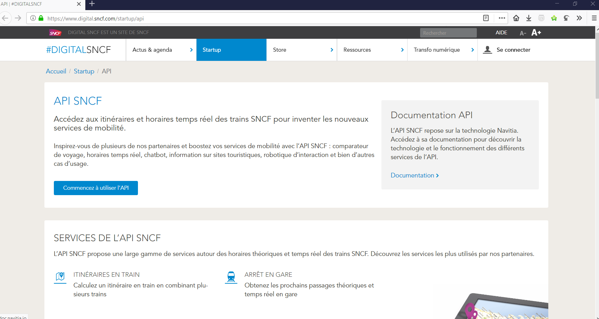
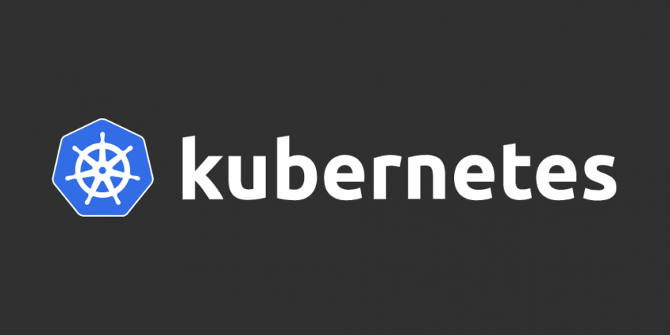
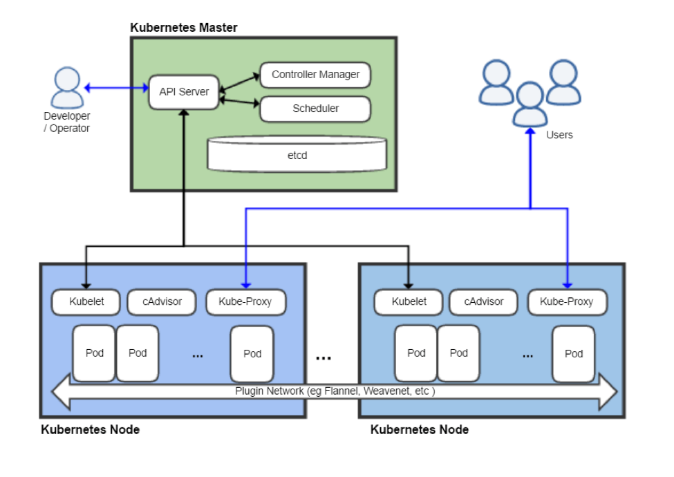
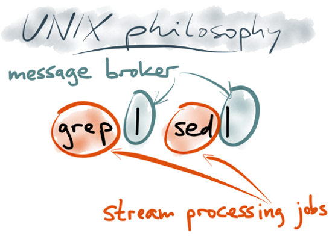
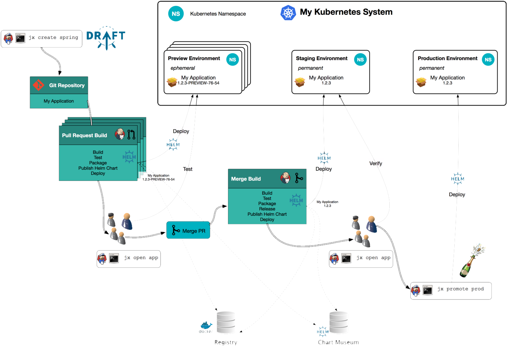

:icons: font
:revealjs_history: true
:revealjs_previewLinks: true

= Avoir un train à l'heure, c'est kafkaïen
[NOTE.speaker]
--
**Logan**
--

== Nous

* Nicolas Delsaux / @riduidel sur https://twitter.com/riduidel[icon:twitter[]] / https://github.com/riduidel[icon:github[]] / https://stackexchange.com/users/8620[icon:stack-overflow[]]
* Logan Hauspie / @lhauspie sur https://twitter.com/lhauspie[icon:twitter[]] / https://github.com/lhauspie[icon:github[]]

[NOTE.speaker]
--
**Nicolas** se présente.
**Logan** se présente et enchaîne.

Donc on est tous les deux du Nord.
Mais Logan vient de Douai.
Comment il va à Lille ? Ben en train, parce que l'autoroute est à peu près inutile.
Mais son TER est parfois en retard.
Et vous ? (enchaînement)
--

[background-iframe="http://raildar.fr/#lat=45.3068&lng=5.6374&zoom=10"]
=== Vous (merci http://raildar.fr/#lat=45.3068&lng=5.6374&zoom=10[Raildar])

[NOTE.speaker]
--
**Logan**
Les images de Raildar sont carrément à la bourre, et c'est dommage. 
Mais quand même, il y a des trains qui sont un peu (ou beaucoup) en retard.
Est-ce qu'on peut faire aussi bien que Raildar ? Voire même mieux ?
--

[%notitle]

[background-iframe="https://whereismytrain.in/"]
=== Qu'est-ce qu'on peut faire ?
[%notitle]

[NOTE.speaker]
--
**Logan**
Est-ce qu'on peut faire aussi bien que cette application indienne ?
--

== Des données !

[NOTE.speaker]
--
**Logan**
Grâce à l'OpenData, la SNCF nous "garantit" un accès à ses données.
En fait, l'accès utilise l'API Navitia, implémentée pour la plupart des transports urbains.
Donc ce qu'on va montrer là peut, plus ou moins, être appliqué pour les transports urbains (donc les bus par exemple).
Qu'est-ce qu'on peut en faire ?
--

=== Que faire de ces données ?

* Un bête script en console pour afficher l'horaire de mon train ?
** Il y a  http://weboob.org/applications/traveloob[WeBoob]
* Un moteur de recherche d'horaires de train pour savoir à quelle heure passe le train
** Il y a https://www.horairetrain.fr[HoraireTrain]
* OK, et si on faisait une appli qui donne le retard des trains crowdsourcés ?

[NOTE.speaker]
--
**Logan**

* Un bête script en console pour afficher l'horaire de mon train ? Mouais ... sympa, mais
** En public, c'est pas très impressionant
** Ca n'est pas le sujet de notre conférence
* Un moteur de recherche d'horaires de train pour savoir à quelle heure passe le train
** Est-ce que ça n'est pas ce que fait la SNCF ou https://www.horairetrain.fr[HoraireTrain] ?
* OK, et si on faisait une appli qui donne le retard des trains crowdsourcés ?
** Ca veut dire récupérer l'horaire du train, et le confronter à l'horaire de passage aux arrêts précédents
--

== Quels prérequis à notre appli ?

* Il nous faut des serveurs
* Il faut transformer nos données
* Il faut rechercher dans nos données

[NOTE.speaker]
--
**Logan**
--
=== Il nous faut des serveurs

[NOTE.speaker]
--
**Nicolas**

On est en 2019 (et Bonne Année), donc on ne va pas déployer une application native sur une machine physique.
Non. 
Comme on est jeunes et modernes, on va faire des conteneurs qu'on va déployer dans un environnement facile à exploiter.
Et pour ça, le marché a voté (comme toujours avec ses pieds) et a choisi Kubernetes.
Donc on suit.
--

=== keskecé ?

[NOTE.speaker]
--
**Nicolas**

Kubernetes fournit un moyen de déployer facilement nos conteneurs Docker et d'y accéder, 
mais pas seulement.
Kubernetes fournit aussi le moyen de décrire son environnement à travers des fichiers YAML, 
et s'occupe de vérifier que le YAML que le développeur écrit est correctement déployé sur le cluster.
Kubernetes fournit enfin le moyen à certains conteneurs privilégiés d'opérer sur le cluster.
On les appelle des **opérateurs**. On trouve par exemple 

* Istio et les services meshes
* Couchbase, kafka, ElasticSearch et toutes les autres bases de données
* Helm, Skaffold et autres outils de déploiement
* Weave Flux, jenkins-X comme opérateurs CI/CD
--

== Il faut déployer nos applications

**TODO Illustration CI/CD avec K8s**

[NOTE.speaker]
--
**Nicolas**

En 2019, on ne veut plus développer notre application, et la déployer après 3 mois de code.
On veut pouvoir itérer rapidement.

Pour ça, il nous faut un certain nombre de services : 
du déploiement, 
une registry maven/docker, 
et des outils pour passer facilement d'une version à une autre.
Coup de bol, c'est ce qu'apporte Jenkins-X !
--

=== Pourquoi Jenkins-X

* Jenkins
* https://www.weave.works/blog/gitops-operations-by-pull-request[GitOps] (comme https://github.com/weaveworks/flux[Weave Flux])
* Mais aussi
** Nexus
** Chartmuseum

[NOTE.speaker]
--
**Nicolas**

On pourrait parfaitement mettre Jenkins en amont de notre environnement Kubernetes et pousser des images validées.
Alors pourquoi utiliser plutôt un opérateur ?

Parce que ça apporte plusieurs avantages.
D'abord, Jenkins-X ne contient pas que Jenkins comme on le voit à l'écran :

TODO lister les composants de l'opérateur

Ensuite, comme on va le voir plus tard, Jenkins-X fournit un déploiement par pull request de chaque projet.
Il est donc facile de paralléliser le test des différents composants sur un environnement conforme à la prod.
--

=== Installer Kubernetes avec Jenkins-X

* Installer la ligne de commande `jx` sur une machine
* Créer le cluster Kubernetes 
** Répondre à quelques questions
** Attendre 5 minutes 

[NOTE.speaker]
--
**Nicolas**

La grosse contrainte de GKE, c'est qu'il faut une autorisation Google, qu'on obtient à travers un navigateur.
Il faut donc exécuter `jx` sur une machine disposant d'une interface graphique (ce qui exclut la VM headless GCE).

[source,sh]
----
include::../../build/0-install.sh[lines=3]
----

ou sous Windows

[source,bat]
----
include::../../build/0-install.bat[lines=2]
----

--

=== Démo

[NOTE.speaker]
--
**Nicolas**

Les outils installés sont

[source]
----
$ jx open
Name                      URL
jenkins                   http://jenkins.jx.35.190.213.22.nip.io
jenkins-x-chartmuseum     http://chartmuseum.jx.35.190.213.22.nip.io
jenkins-x-docker-registry http://docker-registry.jx.35.190.213.22.nip.io
jenkins-x-monocular-api   http://monocular.jx.35.190.213.22.nip.io
jenkins-x-monocular-ui    http://monocular.jx.35.190.213.22.nip.io
nexus                     http://nexus.jx.35.190.213.22.nip.io
----

Avec en bonus un petit tour sur l'environnement de prod accessible dans GitHub : https://github.com/Zenika/environment-snowcamp-2019-production

**NE PAS OUBLIER HELM**
--

== Il faut transformer les données

[NOTE.speaker]
--
**Logan**

Il faut absolument s'appuyer sur les notions mentionnées dans https://www.confluent.io/blog/apache-kafka-samza-and-the-unix-philosophy-of-distributed-data/

Un article plutôt bon pour synthétiser https://www.elastic.co/fr/blog/just-enough-kafka-for-the-elastic-stack-part1
--

=== Techniquement ?

Kafka est un journal immutable distribué.

* Un producteur peut ajouter une entrée dans ce journal
* Un consomateur peut lire le contenu de ce journal

[NOTE.speaker]
--
**Logan**
--

=== Fonctionnellement ?

Kafka est un broker distribué supportant plusieurs paradigmes

* At most once
* Exactly once
* At least once

Ca influe sur la rapidité et la fiabilité du cluster

[NOTE.speaker]
--
**Logan**

Comme Kafka est simple fonctionnellement, un écosystème s'est construit autour pour mieux gérer certains aspects.
On va utiliser dans cette démo Kafka Connect, mais il faut aussi mentionner

* Kafka Streams
* KSQL
* Kafka Schema Registry
--

=== Allons-y !

On installe Kafka avec Helm ... Comme ça

[WARNING]
--
**Nicolas ?**
Il y a plusieurs charts Helm Kafka. Et celui fourni par Bitnami ne contient que Kafka et Zookeeper.
Or on veut plus que ça.
Il faut donc utiliser le chart https://docs.confluent.io/current/installation/installing_cp/cp-helm-charts/docs/index.html[fourni par Confluent]
--

[source,bat]
----
include::../../build/0-install.bat[lines=6..9]
----

Et il faut ajouter un client Kafka 
et quelques interfaces (Topics UI, Connect UI)

[source,bat]
----
include::../../build/0-install.bat[lines=12..14]
----

Les accès se font via des `port-forward` :

[source]
----
kubectl port-forward --namespace kafka kafka-topics-ui 28001:8000
kubectl port-forward --namespace kafka kafka-connect-ui 28002:8000
----

== Il faut rechercher les données

[NOTE.speaker]
--
**Nicolas**
Installer Elastic avec Helm

[source,bat]
----
include::../../build/0-install.bat[lines=17..22]
----

--

=== Elastic

* Base de données NoSQL orientée documents
* Moteur de recherche distribué basé sur Lucene
* Accessible via une API HTTP

[NOTE.speaker]
--
**Nicolas**
Accéder à Elastic

[source]
----
kubectl port-forward --namespace elastic (kubectl get pod --namespace elastic --selector="app=elasticsearch,release=elasticsearch,component=client" --output jsonpath='{.items[0].metadata.name}') 18180:9200
----

--

=== Kibana

* Interface de visualisation des documents stockés dans Elastic
* Facilement configurable
* Utilisable dans une application web publique

[NOTE.speaker]
--
**Nicolas**
Accéder à l'interface de Kibana

[source]
----
kubectl port-forward --namespace elastic (kubectl get pod --namespace elastic --selector="app=kibana,release=kibana" --output jsonpath='{.items[0].metadata.name}') 18181:5601
----

--

=== Connecter Kafka à Elastic

Avec l'https://docs.confluent.io/current/connect/references/restapi.html[interface REST de Kafka Connect] !

[NOTE.speaker]
--
**Logan**
Donc on forwarde le port de kafka-connect localement

[source]
----
kubectl -n kafka port-forward $(kubectl -n kafka get endpoints kafka-cp-kafka-connect -o jsonpath='{.subsets[0].addresses[0].targetRef.name}') 18083:8083
----

Et on envoie la patate avec curl

[source]
----
curl -v -X POST --data "@src/k8s/kafka/kafka-connect-elastic.json" -H "Content-Type: application/json" http://localhost:18083/connectors
----
--

== Comment ça s'assemble ?

Démonstration avec Weave Scope !

[source,bat]
----
include::../../build/0-install.bat[lines=25]
----

[source]
----
kubectl -n weave-scope port-forward $(kubectl -n weave-scope get endpoints weave-scope-weave-scope -o jsonpath='{.subsets[0].addresses[0].targetRef.name}') 18080:4040
----

[NOTE.speaker]
--
**Nicolas**
--

== Et si on codait quelque chose ?

Par exemple une application qui lit les données depuis Navitia

[NOTE.speaker]
--
**Logan**
--

=== D'abord on crée l'application

[source]
----
jx create quickstart 
----

[NOTE.speaker]
--
**Nicolas**
D'abord on crée l'application

[source]
----
mkdir reader && cd reader && jx create quickstart 
----

Les réponses dans l'ordre

1. vertx-prometheus
2. snowcamp-2019-sncf-timesheet-reader
3. Organization: Zenika

J'ai passé toutes les réponses évidentes.
A la fin, on a

1. Un repository GitHub ( https://github.com/Zenika/snowcamp-2019-sncf-timesheet-reader)
2. un projet Jenkins ( http://jenkins.jx.35.240.72.245.nip.io/job/Zenika/job/snowcamp-2019-sncf-timesheet-reader/)

Et ensuite, on inejcte le code avec la commande `1-write-reader-code.bat` (qui inclut la gestion des secrets et de la config)

Pendant que Jenkins builde la pull request, on parle de la configuration
--

=== Comment gérer la configuration ?

* ConfigMap
* chart helm

[NOTE.speaker]
--
**Nicolas**
On peut facilement créer un secret dans les namespaces staging et production, mais pas dans le namespace généré pour les previews.
Alors on fait comment ?
Comme le chart helm des previews hérite du chart utilisé en staging et en production, 
on peut ajouter une ConfigMap dans le chart preview !
--

=== Comment gérer les secrets ?

* helm secrets ... ne marche pas
* Mais la modification du Jenkinsfile, oui !

[NOTE.speaker]
--
**Nicolas**
On a un secret commun : notre clé d'API.
Elle doit être, comme la configuration, disponible dans les trois types de namespaces.
Malheureusement, 
une série de bugs dans helm secrets et Jenkins-X (en particulier la gestion de fichiers partiellement chiffrés) le rend inutile dans notre cas.
Donc il faut utiliser ... une autre méthode (qui ne sera malheureusement pas applicable pour, par exemple, des accès de base de données différents pour les différents types de déploiement).
En l'occurence, comme on peut éditer le `Jenkinsfile`, on peut y ajouter la copie du secret d'un namespace à un autre au début du déploiement du chart.

Evidement, dans une vision plus complète, il serait bien d'utiliser Vault, qui permet d'avoir le secret correctement associé au pod.
--

=== !

[NOTE.speaker]
--
**Nicolas**
Dans la démo, on merge la pull request et on observe que l'environnement staging est bien rebuildé avec la nouvelle version.
Et de la même manière, en faisant un `jx promote`, on fait passer l'application en production.
--

== Qu'est-ce qu'on a ?

* Une application déployée dans un environnement de test
* Du contenu poussé à travers Kafka dans Elastic

[NOTE.speaker]
--
**Logan**
Notre application est accessible par `jx open ...`.
Cette application permet, en accédant à `sncf/routes?reload` de charger les horaires SNCF dans Elastic.
On peut en voir le contenu dans Kibana.
--

== Et ensuite ?

* Et si on créait une application web pour rechercher nos horaires ?

[NOTE.speaker]
--
**Nicolas**
Avec `jx create quickstart`, on peut aussi créer une application node, pratique pour notre page de recherche des gares et des horaires.
--

== Conclusion

* Kubernetes, Kafka et Elastic sont des technologies fiables, utilisables dans vos projets facilement
* Jenkins-X permet facilement de déployer des applications dans des infrastructures modernes

[NOTE.speaker]
--
**Logan**
--

=== Merci !

image::images/questions.gif[background, size=cover]

[NOTE.speaker]
--
**Nicolas**
--
